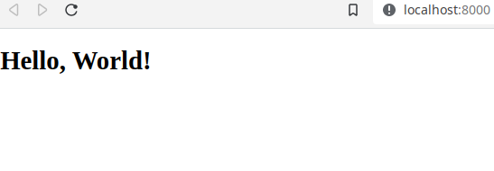

# remix-deno-tailwindcss

## Todo
-[] Add TailwindCSS
-[] esm.sh cache for @remix-run/server-runtime. Seems to have to download this every time.
-[] Remix meta v2

## license
[MIT](./LICENSE.md)

## Hello, World`

